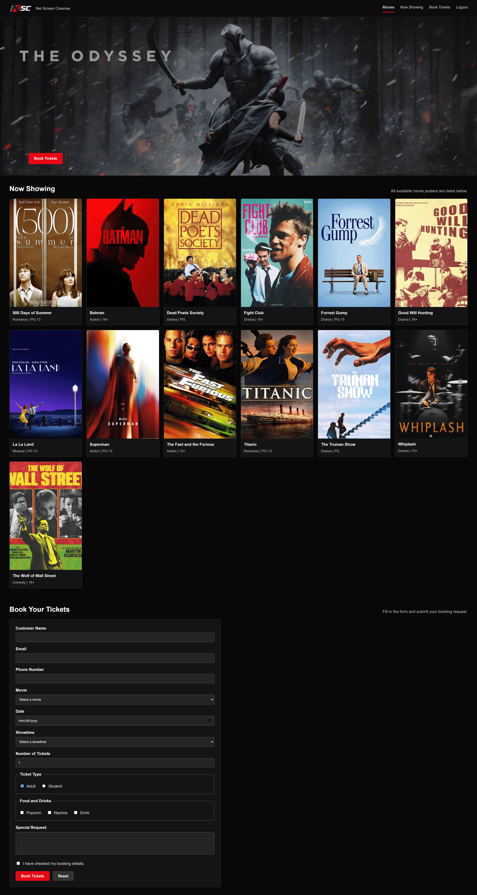

# Cinema Ticketing System



A simple cinema ticketing website developed as a group project for **SPG 0473 Web Programming** at German-Malaysian Institute.

The project focuses on basic web development using HTML and CSS, including form validation, different HTML input types, page navigation, and a cinema ticket booking interface.

## Features

- Login page with HTML validation
- Movie browsing section
- Cinema ticket booking form
- Multiple form input types
- Ticket type selection
- Food and beverage options
- Booking confirmation page
- Navigation between pages
- Responsive layout

## Technologies

- HTML5
- CSS3

## Project Structure

```text
cinema-ticketing-system/
├── index.html
├── booking.html
├── confirmation.html
├── styles.css
├── images/
└── README.md
